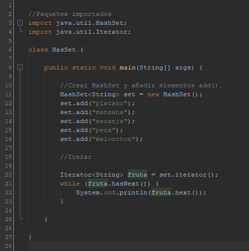
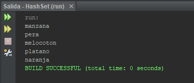

# HashSet #

### Concepto ###

HashSet es una de las implementaciones de la interfaz _"Set"_. No permite manejar nada con respecto al orden de los elementos.
Almacena sus valores en una _**tabla hash**_, que es una tabla que permite guardar elementos por función _hash_(función que recoge elementos que queremos insertar y devuelve valor único).

HashSet no permite elementos repetidos, para asegurarse de no ingresar objetos repetidos se decidió utilizar un _HashMap_ internamente el cual tampoco permite objetos repetidos.

Proporciona la mayoría de operaciones de acceso en tiempo constante, entonces la eficiencia es más rapida.

### Características de HashSet ###

- No podemos predecir nada sobre el orden
- Mejor rendimiento de todas
- Permite insertar valores nulos
- La implementación no está sincronizada(Si varios subprocesos acceden a un conjunto de hash simultáneamente, y al menos uno de los subprocesos modifica el conjunto, debe sincronizarse externamente)
- Está respaldado por HashMap
- No permite elementos repetidos()
- Se mejora el rendimiento si se establece una capacidad inicial no muy elevada

### Algunos métodos HashSet ###

- add() --> Se utiliza para agregar un elemento especifico a este conjunto si aún no está presente
- clear() --> Elimina todos los elementos de este conjunto
- clone() --> Devuelve una copia superficial de esta instancia de HashSet : los elementos en sí no están clonados
- iterator() --> Devuelve un iterador sobre los elementos de este conjunto 
- size() --> Devuelve el número de elementos en este conjunto (su cardinalidad)

### Funcionamiento de HashSet ###

Ejemplo sencillo del funcionamiento de la clase HashSet. Los elementos iteran en una colección desordenada

Como hemos dicho antes, no podemos predecir nada sobre el orden de los elementos.

